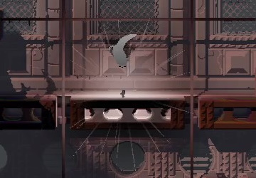

# 301 Moved Permanently
This repository is for Rain World v1.5. The updated version for Rain World v1.9 is available [here](https://github.com/Dual-Iron/hydrogen-rocks).

# Content
Makes rocks explode when you throw them.

This repository is a good starting point for new mod developers. Feel free to take code from it.

